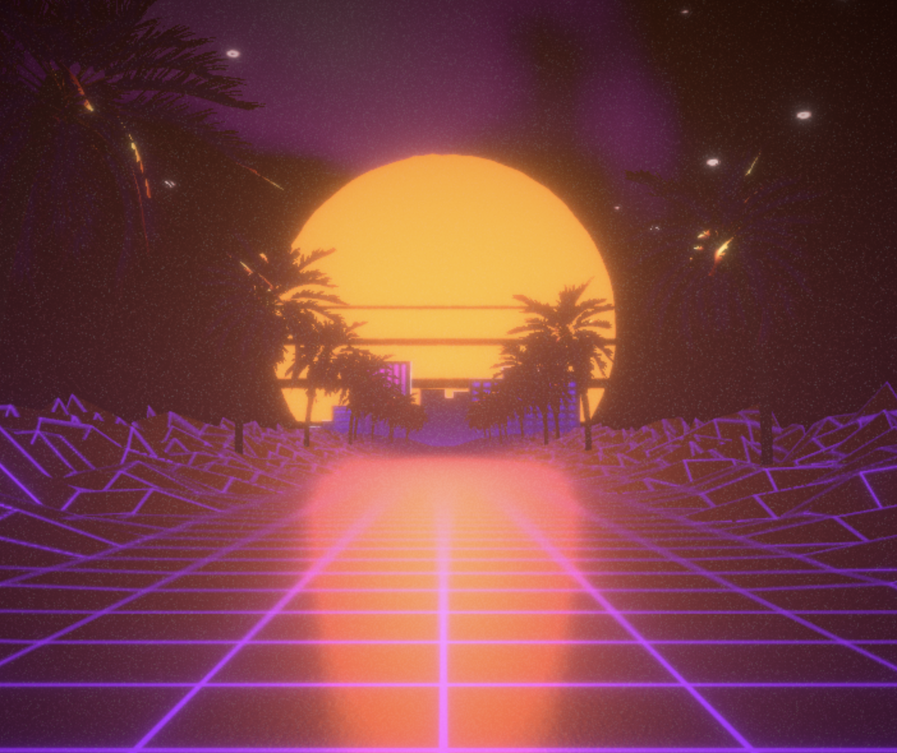

## Classical synthwave experience done with R3F

 
Demo <a href="https://virbas.github.io/synthwave-r3f/" target="_blank">https://virbas.github.io/synthwave-r3f/</a>
 
Clone and run `npm i & npm run dev`
 
Works on VR headsets as well. However, due to three.js not supporting postprocessing for VR just yet, effects are removed in `immersive-vr` mode.

